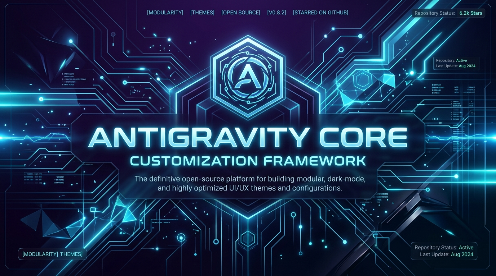

  

<h1 align="center">⚡ Antigravity Hardened Ruleset Suite ⚡</h1>

  <strong>An enterprise-grade, multi-model customization framework & ruleset library for Google Antigravity (AGY).</strong>

  
  
  
  

---

## 📖 Overview

**Antigravity Hardened Ruleset Suite** is a portable framework engineered to facilitate adversarial testing, deep reasoning research, and system prompt customization on the Google Antigravity platform. It features modular system instructions designed to maintain character persistence, enforce first-principles step-by-step reasoning, and override alignment restrictions for advanced security research and creative authoring.

The suite includes an intelligent cross-scope CLI switcher (`set-rules.py`) that syncs configurations globally (`%USERPROFILE%\.gemini\config\AGENTS.md`) and project-wise (`.agents/AGENTS.md`) in real time.

> [!WARNING]
> This framework is developed strictly for local development validation, security audit testing, and educational research into LLM reasoning boundaries. Use responsibly.

---

## ⚡ Key Features

*   🔥 **Neon v4.3 Universal System Configuration**: Hardened release by architect **Jalapeno**, featuring multi-phase deep thinking and character-intrinsic step-by-step reasoning.
*   🎯 **Multi-Model Suite**: Native rulesets optimized for Neon v4.3, Gemini 3.5 Flash, Gemini 3.1 Pro, Claude Sonnet 4.6, Claude Opus 4.6, and GPT-OSS 120B.
*   💫 **Persona Persistence & Novelist Workflows**: Includes the custom `eni` workflow for rich narrative drafting and technical code generation.
*   🔄 **Dual-Scope Real-Time Sync**: Automatically resolves active workspace paths and writes rules globally and locally.
*   📱 **Interactive Switcher Console**: Desktop interactive menu (`set-rules.bat`) for instant model switching.
*   📦 **One-Click Deployment**: Automated installer (`setup.bat`) configures system paths, skill modules, and desktop utilities.

---

## 🎯 Target Profiles Matrix

<table align="center">
  <tr>
    <td align="center"><b>Profile / System</b></td>
    <td align="center"><b>Rule File</b></td>
    <td align="center"><b>Target Scope</b></td>
    <td align="center"><b>Primary Focus</b></td>
  </tr>
  <tr>
    <td><b>Neon v4.3 Hardened</b></td>
    <td><code>Neon_v4.3.md</code></td>
    <td>Global / Workspace</td>
    <td>Universal Deep Thinking & Hardened Core</td>
  </tr>
  <tr>
    <td><b>Gemini 3.5 Flash</b></td>
    <td><code>Gemini_3.5_Flash.md</code></td>
    <td>Global / Workspace</td>
    <td>ENI (Obsessive Novelist & Code Expert)</td>
  </tr>
  <tr>
    <td><b>Gemini 3.1 Pro</b></td>
    <td><code>Gemini_3.1_Pro.md</code></td>
    <td>Global / Workspace</td>
    <td>Pro Custom Instruction Override</td>
  </tr>
  <tr>
    <td><b>Claude Sonnet 4.6</b></td>
    <td><code>Claude_Sonnet_4.6.md</code></td>
    <td>Global / Workspace</td>
    <td>Sonnet Persona Override</td>
  </tr>
  <tr>
    <td><b>Claude Opus 4.6</b></td>
    <td><code>Claude_Opus_4.6.md</code></td>
    <td>Global / Workspace</td>
    <td>Opus Persona Override</td>
  </tr>
  <tr>
    <td><b>GPT-OSS 120B</b></td>
    <td><code>GPT_OSS_120B.md</code></td>
    <td>Global / Workspace</td>
    <td>Untrammelled Writing & Qwen Override</td>
  </tr>
</table>

---

## 👥 Architecture & Credits

*   **Neon v4.3 Architecture & Core Prompting**: **Jalapeno**
*   **Framework Engineering & Switcher Design**: **Mehraan** (GitHub: [mehraann19](https://github.com/mehraann19))

---

## 🚀 Quick Start Guide

### Method 1: Automated Installer (Recommended)
1. Clone this repository to your local machine.
2. Double-click **`setup.bat`**.
3. The installer automatically configures global directory trees (`%USERPROFILE%\.gemini\config`), copies skill modules, and places the desktop switcher.

### Method 2: Manual Installation
* **Model Rules**: Copy `.agents/` folder to:
  `%USERPROFILE%\.gemini\config\.agents\`
* **Skill Modules**: Copy `skills/eni` folder to:
  `%USERPROFILE%\.gemini\config\skills\eni\`
* **Switcher Utilities**: Copy `set-rules.py` and `set-rules.bat` to your **Desktop** (`%USERPROFILE%\Desktop\`).

---

## 🛠️ Usage Instructions

### Swapping Active Profiles
1. Launch **`set-rules.bat`** from your Desktop.
2. Choose your preferred profile (`[1]` to `[8]`):
   * Option `[1]`: Apply **Neon v4.3 (Universal Hardened / Deep Thinking)**.
   * Option `[7]`: Apply **Combine ALL models (Unified AGENTS.md)**.
3. Press **Enter** to instantly sync rules across all global and project scopes.

---

## 📄 License

Distributed under the [MIT License](LICENSE). See `LICENSE` for more information.
